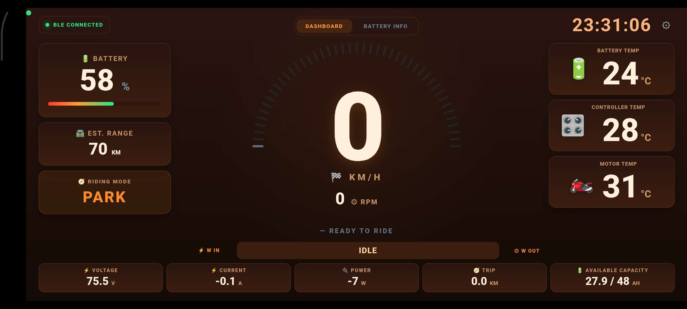
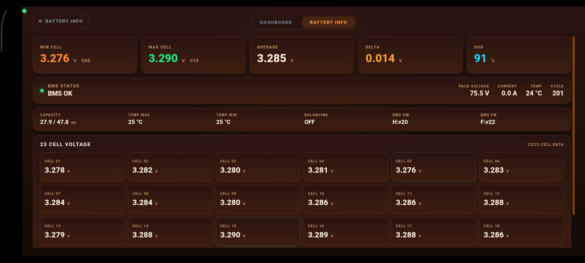

# FOX R EV Dashboard

Web-based digital dashboard untuk motor listrik **Polytron Fox R**, dirancang dengan tampilan modern bergaya OEM dan dapat digunakan sebagai dashboard/speedometer digital pada perangkat Android, tablet, maupun display berbasis WebView.

Dashboard ini menggabungkan tampilan informasi kendaraan, data baterai, RPM, temperatur, daya listrik, trip, serta berbagai mode tampilan yang dapat disesuaikan melalui menu Settings.

# Download
Buka halaman **[Releases](https://github.com/jagoanpilot/Fox-Drive/releases)** pada repositori ini.

---

## ✨ Features

### 🏍️ Main Dashboard

* Digital speedometer hingga **999 km/h**
* RPM motor hingga **1400 RPM**
* Status mode:

  * P
  * N
  * C
  * D
  * S
  * R
* Brake indicator
* Battery State of Charge (SOC)
* Battery temperature
* Motor temperature
* Controller temperature
* Voltage
* Current
* Power
* Energy consumption
* Regenerative braking information
* Trip distance
* Odometer

---

## 🔋 Battery Information

Dashboard dapat menampilkan informasi baterai secara real-time.

Informasi yang dapat ditampilkan antara lain:

* Battery SOC
* Battery voltage
* Battery current
* Battery power
* Battery capacity
* Battery temperature
* Minimum cell voltage
* Maximum cell voltage
* Average cell voltage
* Cell voltage difference
* Battery SOH
* Cycle count
* Individual cell information

Dashboard dirancang agar kapasitas baterai dapat digunakan oleh beberapa bagian UI, termasuk halaman utama dan informasi baterai.

---

## ⚡ Power Monitoring

Dashboard dapat menampilkan penggunaan daya kendaraan secara real-time.

### Power OUT

Menampilkan daya yang digunakan motor/controller ketika kendaraan berjalan.

### Power IN

Menampilkan daya yang masuk ke baterai ketika:

* Charging
* Regenerative braking

### Standby

Ketika tidak terdapat konsumsi atau pengisian daya yang signifikan, status dapat berubah menjadi:

`STANDBY`

### Power

Ketika kendaraan menggunakan energi:

`POWER`

### Charging

Ketika terdapat arus masuk ke baterai:

`CHARGING`

---

# 📊 RPM Display

RPM menggunakan skala hingga:

0 - 1400 RPM

RPM ditampilkan menggunakan indikator visual pada dashboard.

Contoh:

0     200     400     600     800     1000    1200    1400
|------|-------|-------|-------|--------|--------|--------|

Nilai RPM dapat diperbarui berdasarkan data motor/controller.

---

# 🌡️ Temperature Display

Informasi temperatur ditampilkan secara terpisah agar mudah dibaca.

Contoh informasi:

MOTOR
45°C

CONTROLLER
38°C

BATTERY
32°C

Nilai temperatur dibuat lebih kecil dibandingkan informasi utama seperti speed dan RPM sehingga hierarki informasi tetap jelas.

---

# 📱 Responsive Design

Dashboard dirancang untuk berbagai ukuran layar:

* Smartphone
* Tablet

Layout menggunakan responsive HTML/CSS sehingga dapat menyesuaikan ukuran layar.

---

# 🖥️ Supported Display

Contoh perangkat yang dapat digunakan:

* Android Smartphone
* Android Tablet

Untuk penggunaan pada kendaraan, disarankan menggunakan layar landscape.

---

# 📄 Dashboard Pages

## Page 1 — Main Dashboard

Halaman utama berisi informasi kendaraan seperti:

* Speed
* RPM
* SOC
* Battery
* Power
* Temperature
* Driving mode
* Brake
* Trip
* Odometer

---

## Page 2 — Battery / Cell Information

Halaman informasi baterai digunakan untuk melihat kondisi setiap cell.

Informasi yang dapat ditampilkan:

CELL 01
CELL 02
CELL 03
...
CELL 23

Beserta informasi:

* Cell voltage
* Minimum voltage
* Maximum voltage
* Average voltage
* Cell difference
* Battery temperature
* SOH
* Cycle

Dashboard dapat disesuaikan untuk battery pack dengan jumlah cell yang berbeda.

---

# 📡 Vehicle Data Integration

Dashboard dapat digunakan sebagai frontend untuk sistem komunikasi kendaraan.

Contoh sumber data:
ESP32
   │
   ├── CAN Bus
   │
   ├── BLE
   │
   └── WiFi
          │
          ▼
     Web Dashboard

Data kendaraan dapat digunakan untuk memperbarui:

Speed
RPM
Voltage
Current
Power
SOC
Temperature
Cell Voltage
Trip
Odometer

---

# 🔌 ESP32 Integration

Project dapat dikembangkan untuk digunakan bersama ESP32 sebagai gateway data.

Contoh arsitektur:

Motor / Controller
        │
        │ CAN Bus
        ▼
      ESP32
        │
        │ BLE / WiFi
        ▼
   Android / Tablet
        │
        ▼
   FOX R Dashboard

Dengan arsitektur tersebut, dashboard HTML berfungsi sebagai antarmuka pengguna sedangkan ESP32 menangani komunikasi dengan kendaraan.

---

# 📷 Preview

---

# 🔧 Customization

Project dapat dimodifikasi sesuai kebutuhan kendaraan.

Beberapa bagian yang dapat dikembangkan:

* Maximum speed
* Maximum RPM
* Battery capacity
* Number of battery cells
* Temperature limit
* Power limit
* Current limit
* Energy calculation
* Efficiency calculation
* Trip calculation
* Dashboard theme
* Dashboard layout

---

# ⚠️ Disclaimer

Project ini merupakan project dashboard/interface dan **bukan perangkat keselamatan kendaraan**.

Pastikan data dari CAN Bus, BMS, controller, sensor, dan perangkat lain telah diverifikasi sebelum digunakan untuk kebutuhan berkendara.

Jangan menggunakan informasi dashboard sebagai satu-satunya sumber untuk menentukan kondisi keselamatan baterai, motor, controller, atau kendaraan.

---

# 👨‍💻 Project

**FOX R EV Dashboard**

Dashboard untuk monitoring dan visualisasi data kendaraan listrik dengan fokus pada:

Speed
RPM
Battery
Power
Temperature
Trip
Odometer
Cell Information
Dashboard UI

---